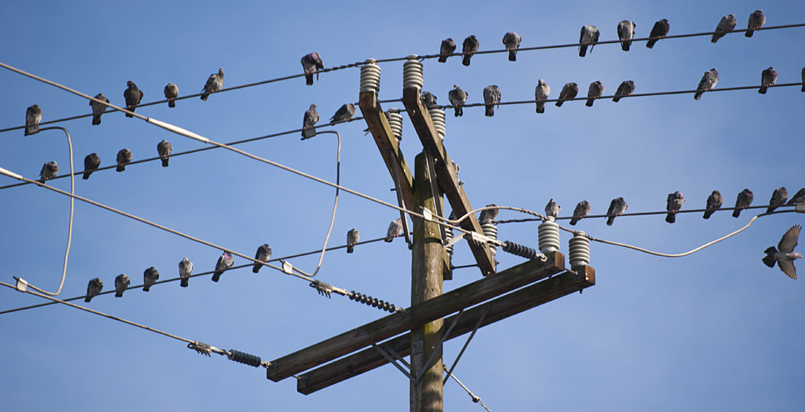
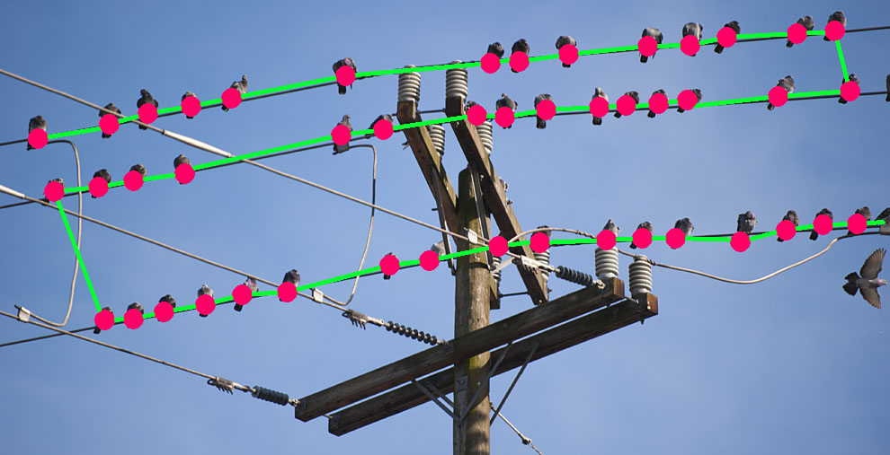

# Music-From-Nature-Patterns
A simple but fun program to create music from any pair-wise 1D data. From anywhere.

## How to use it?
1. First choose an image that contains some interesting stuff to transform to a melody:

2. Use `label_picture.py` to label the picture:

3. Use the .npy data generated in the `main.py` to create the melody. You can try different distances, audio length or notes length. It can also use music scales when the parameter `autotune` is `True`.
4. Done!
